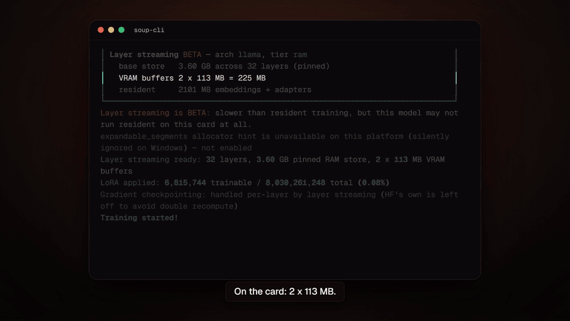
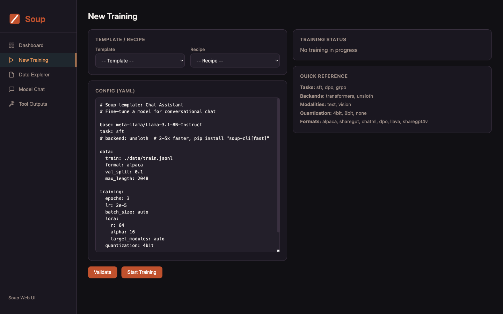

<!-- synced-from: README.md sha256:4ca93d27b5036696b6310f552a6be84216c3c72eae59bb2d37dc4f03bd4c4505 -->
<p align="center">🌍 <a href="README.md">English</a> | <a href="README.tr.md">Türkçe</a> | <a href="README.ar.md">العربية</a> | <a href="README.ja.md">日本語</a> | <strong>中文</strong></p>

<p align="center">
  
</p>

<h1 align="center">Soup</h1>

<p align="center">
  <strong>一条命令完成 LLM 微调与后训练。无需 SSH，告别配置地狱。</strong>
</p>

<p align="center">
  <a href="https://trysoup.dev">官网</a> &middot;
  <a href="#快速开始">快速开始</a> &middot;
  <a href="#web-ui">Web UI</a> &middot;
  <a href="#配置">配置</a> &middot;
  <a href="#文档">文档</a> &middot;
  <a href="docs/commands.md">命令</a> &middot;
  <a href="docs/models.md">模型</a> &middot;
  <a href="https://discord.gg/dgd2pJcjwP">Discord</a> &middot;
  <a href="https://t.me/souptasters">Telegram</a> &middot;
  <a href="https://www.producthunt.com/products/soup-cli">Product Hunt</a>
</p>

<p align="center">
  <a href="https://pypi.org/project/soup-cli/"></a>
  <a href="https://pepy.tech/project/soup-cli"></a>
  
  
  <a href="https://github.com/MakazhanAlpamys/Soup/actions"></a>
  <a href="https://github.com/MakazhanAlpamys/Soup/actions"></a>
  <a href="https://trysoup.dev"></a>
  <a href="https://discord.gg/dgd2pJcjwP"></a>
  <a href="https://t.me/souptasters"></a>
  <a href="https://doi.org/10.5281/zenodo.21771064"></a>
</p>

<p align="center">
  <a href="https://www.producthunt.com/products/soup-cli?embed=true&amp;utm_source=badge-featured&amp;utm_medium=badge&amp;utm_campaign=badge-soup-cli">
    <picture>
      <source media="(prefers-color-scheme: dark)" srcset="https://api.producthunt.com/widgets/embed-image/v1/featured.svg?post_id=1217869&amp;theme=dark">
      
    </picture>
  </a>
  <a href="https://trendshift.io/repositories/98395?utm_source=repository-badge&amp;utm_medium=badge&amp;utm_campaign=badge-repository-98395" target="_blank" rel="noopener noreferrer">
    
  </a>
</p>

---

Soup 把 LLM 微调的痛点变成一条简单的工作流。一份配置、一条命令，搞定。

```bash
pip install "soup-cli[train]"   # 加 [train] 才能微调；裸 `soup-cli` 是轻量 CLI
soup init --template chat
soup train
```

**在 4 GB 笔记本 GPU 上微调 8B 模型。** Layer streaming 让冻结的基座模型不占
显存，按解码层逐层送入 GPU。在 RTX 3050 Laptop 4 GB 上实测：Llama-3.1-8B-Instruct +
NF4 达到 **119.6 tok/s，峰值 3.32 GB**——与常规常驻显存的运行逐位一致，并在 H100 上
以同样的 3.32 GB 独立复现出 113.00 tok/s。（两个数字都测自 v0.72.2，早于 v0.73.0 那次
在 32B 上付出 −4.8% 代价的正确性修复；此后没有在 4 GB 卡上重测——复测进度见 issue
[#361](https://github.com/MakazhanAlpamys/Soup/issues/361)。）需显式开启
（`stream_layers: true`），仍是 BETA——
[工作原理](docs/performance-and-quantization.md#layer-streaming-beta-v0720-nf4-v0722-disk--wider-archs-v0723-preference-losses-v0724) ·
[全部实测数据](benchmarks/) · [论文](https://doi.org/10.5281/zenodo.21771064) ·
**[在免费 Colab T4 上亲自验证](notebooks/proof-4gb.ipynb)**（把进程限制在 4 GB，
然后断言流式模型与常驻模型逐位一致）

<p align="center">
  <a href="https://youtu.be/T1LCErE943E"></a><br>
  <sub>Llama-3.1-8B-Instruct + NF4、LoRA、batch 1、seq 512，RTX 3050 Laptop 4 GB——<b>峰值 3.32 GB，119.6 tok/s</b>（测自 v0.72.2，早于 #331 修复；复测进度见 issue #361）。<a href="https://youtu.be/T1LCErE943E">完整视频（90 秒）</a></sub>
</p>

## 为什么选择 Soup

训练 LLM 至今仍然痛苦。即便是有经验的团队，也有 30-50% 的时间耗在和基础设施搏斗上，
而不是改进模型。Soup 解决的就是这件事。

- **零 SSH。** 再也不用 SSH 进一台坏掉的 GPU 机器。
- **一份配置。** 一个简单的 YAML 文件就是全部所需。
- **全部自动。** batch size、GPU 检测、量化——都替你处理。
- **本地可跑。** 用自己的 GPU 跑 QLoRA，不需要云。

## 最新动态

**v0.75.0——同一份 `soup.yaml`，在 MLX 上悄悄执行了和 transformers 不同的训练流程。**
六个训练选项经过了校验、写进了文档、也被正常接受——但在那个后端上根本没人读。
**这个版本的全部 60 个 PR 都来自维护者之外的贡献者**，共 22 人。

- **破坏性变更：未知配置键现在直接拒绝加载。** v0.74 起开始警告，并声明以本版本为期限。
  像 `quantizaton` 这样的笔误，或只存在于更新版 Soup 的键，以前会被丢弃而任务照常
  继续——那个设置根本没生效；现在会在 CLI（退出码 1）和 API（`ValueError`）直接失败，
  并报出你很可能想写的字段名。检测器会先做 schema 从 v0.40.1 起就兼容的根级 `lora:`
  重映射，所以这种写法会被接受而非拒绝；`soup fetch examples` 里两处用到它的文件也
  迁到了规范的 `training.lora`。所有配方和模板都能干净加载，键名在到达终端前会被
  转义，扫描是有界的。
- **MLX 后端现在真正应用它接受的配置。** `train_on_responses_only`、`warmup_ratio` /
  `scheduler` / `weight_decay` / `optimizer`、`max_grad_norm`、`gradient_accumulation_steps`
  和 `gradient_checkpointing` 此前各自通过校验后在 `backend: mlx` 上被丢弃。32 个
  optimizer 名称里只有 8 个有 MLX 对应实现；其余 24 个现在按名拒绝，而不是悄悄变成
  AdamW。MLX 后端现在还驱动实时仪表盘、tracker 和 `soup ui`，`soup doctor --config`
  会列出某个后端不读的设置项。
- **验证集损失过去哪里都不存在。** 它在每个后端都被计算出来，然后被扔掉：没有
  metrics 列、没有事件字段、面板上也没有。现在它被记录、流式输出并展示。
- **破坏性变更：`grpo_variant: gspo` 改为论文版的序列级目标函数**
  （arXiv:2507.18071），取代了原来的列居中启发式——在那里面，一个 padding token
  还会挪动同列每一行的梯度。已有的 gspo 配置无法复现此前的运行结果。
- **Web UI 的读取端点和 SSE 现在需要鉴权**，使用短期一次性票据，而不是 query
  string 里的 token；`--public` 不再向局域网开放 `/docs` 和 `/openapi.json`；当
  没有任何东西读取输出时，训练子进程也不再挂起。
- **`torch>=2.6.0`** 关闭了 v0.74.0 的已知限制：在 2.5.1 上 `trl>=0.29` 无法导入，
  所有 preference 训练器都无法工作。同时修复：`training.loraplus_lr_ratio` 会让所有
  设置了它的运行崩溃，`packing: true` 在 TRL 0.29 上会报错。

> 仅支持 Python **3.10–3.12**。在 3.13+ 上，pip 过去会解析到未测试过的 PyTorch
> wheel，在 Soup 运行之前就崩在原生扩展里。

更早的更新记录在 [GitHub Releases](https://github.com/MakazhanAlpamys/Soup/releases) 页面。

## 快速开始

### 1. 安装

Soup 是一个命令行应用，最干净的安装方式是给它一个独立的环境，并把 `soup`
放进你的 `PATH`：

```bash
# 轻量核心：CLI + 配置 + 数据工具，不含 PyTorch
pipx install soup-cli
uv tool install soup-cli          # 同理，如果你已经在用 uv

# 加训练栈（torch、transformers、peft、trl、datasets、…）
pipx install "soup-cli[train]"

# 一次装全（train + serve + ui + data）
pipx install "soup-cli[all]"

# 或者从 GitHub 装（最新开发版）
pipx install "git+https://github.com/MakazhanAlpamys/Soup.git"
```

已经在 virtualenv、Colab notebook 或 Docker 镜像里了？直接用 `pip`，
名字和 extras 都一样：

```bash
pip install soup-cli
pip install "soup-cli[train]"
pip install "soup-cli[all]"
pip install git+https://github.com/MakazhanAlpamys/Soup.git
```

如果你还想在自己的代码里 `import soup_cli`，就用 `pip` 而不是 `pipx`，
因为 pipx 会刻意把应用和其他一切隔离开。

完整的 extras 表（`fast`、`mlx`、`serve`、`eval`、`ui`、`vision`、`audio`、…）在
[`docs/models.md`](docs/models.md#optional-extras)。

> **`error: externally-managed-environment`？** 那是
> [PEP 668](https://peps.python.org/pep-0668/)，不是 Soup 的问题。Debian 12、
> Ubuntu 23.04 及更新版本禁止 `pip` 写入系统 Python，因为那些文件也归 `apt` 管。
> `pipx` 和 `uv tool` 通过给 Soup 独立环境绕开了它，所以它们列在最上面。
> `python3 -m venv .venv && source .venv/bin/activate` 之后再用普通 `pip` 也可以。

> **用双引号，不是单引号。** `"soup-cli[train]"` 是唯一在每种 shell 都能用的写法——
> `cmd.exe`、PowerShell、bash 和 zsh。如果你从旧教程复制了 `'soup-cli[train]'` 而被
> pip 拒绝，原因就是这个：
> [为什么，以及确切报错](docs/models.md#quoting-the-extra)。

`soup init`、`soup data …` 和其他数据/检查命令在轻量安装下就能用。
微调（`soup train`）需要 `[train]` extra。

### 2. 创建配置

```bash
soup init                       # 交互式向导
soup init --template chat       # 或从模板开始
```

模板：`chat`、`code`、`tool-calling`、`medical`、`reasoning`、`vision`、`kto`、`orpo`、
`simpo`、`ipo`、`bco`、`rlhf`、`pretrain`、`moe`、`longcontext`、`embedding`、`audio`。

### 3. 训练、测试、发布

```bash
soup train --config soup.yaml                 # LoRA、量化、batching——全部代劳
soup chat  --model ./output                    # 和你的模型对话
soup push  --model ./output --repo you/my-model

soup merge  --adapter ./output                              # 把 LoRA 合进基座
soup export --model ./output --format gguf --quant q4_k_m   # 导出 GGUF 给 Ollama / llama.cpp
```

更多导出目标（ONNX、TensorRT、AWQ、GPTQ、BitNet）和部署选项在
[`docs/serving-and-export.md`](docs/serving-and-export.md)。

## Web UI

更喜欢浏览器？`soup ui` 提供一个本地仪表盘，可以做实验、配置训练、
看实时指标、探索数据集、和模型聊天。

```bash
pip install "soup-cli[ui]"
soup ui
# 打开 http://127.0.0.1:7860/?token=<token>，终端也会显示同一 URL
```



[Web UI 文档](docs/serving-and-export.md#web-ui)

## 配置

一份完整的 `soup.yaml`：

```yaml
base: meta-llama/Llama-3.1-8B-Instruct
task: sft
# backend: unsloth  # 快 2-5 倍，pip install "soup-cli[fast]"

data:
  train: ./data/train.jsonl
  format: alpaca
  val_split: 0.1

training:
  epochs: 3
  lr: 2e-5
  batch_size: auto
  lora:
    r: 64
    alpha: 16
  quantization: 4bit

output: ./output
```

`config/schema.py` 是每个字段的唯一权威来源。高级数据、训练和 PEFT 选项的文档在
[文档](#文档)一节。

> **自 v0.75 起，未知配置键会被拒绝。** 没有任何模型声明过的键——比如
> `quantizaton` 这样的笔误，或只存在于更新版 Soup 的字段——以前会通过校验然后被
> 丢弃，任务带着"设置没生效"的状态继续跑。v0.74 会在加载时报出来并提示你可能想写的
> 字段；从 **v0.75** 起同样的配置直接加载失败，所以请修正或删掉这个键，别再指望它被
> 忽略。见 [未知配置键](docs/backends-and-ops.md#unknown-config-keys)。

## 文档

完整的功能参考在 [`docs/`](docs/)。从这里开始：

| 指南 | 内容 |
|---|---|
| [训练任务与方法](docs/training.md) | SFT、DPO/GRPO/PPO/KTO/ORPO/SimPO/IPO/BCO、tool-calling、PRM、预训练、蒸馏、分类、视觉/音频/TTS、机器遗忘、RAFT/RA-DIT、训练循环加固检测器 |
| [PEFT、长上下文与效率](docs/peft-and-efficiency.md) | DoRA、LoRA+、rsLoRA、VeRA、OLoRA、NEFTune、PiSSA、ReLoRA、optimizer 与 PEFT 全家桶、LLaMA Pro、GaLore、YaRN/LongLoRA、packing、课程学习、自动调参 |
| [性能与量化](docs/performance-and-quantization.md) | QAT、FP8、量化菜单（I + II）、KV-cache、NVFP4、保存格式、Cut Cross-Entropy、gradient checkpointing、kernel、activation offloading、layer streaming、多 GPU / DeepSpeed / FSDP |
| [数据工程](docs/data.md) | 格式、对齐 Axolotl/LF 的数据管线、数据工具、合成生成与 forge、质量记分卡、trace 工具、远程数据集、混合、recipe DAG |
| [评测与探针](docs/evaluation.md) | eval design/gate、eval-gated 训练、benchmark、NLG 指标、校准、Elo 竞技场、诊断、后训练 X-ray 探针、A/B、漂移、可调性、`soup advise` |
| [服务与导出](docs/serving-and-export.md) | OpenAI 兼容服务器、批量推理、benchmark、merge/export、Anthropic Messages 端点、投机解码（训练并测量你自己的 draft）、deploy autopilot、Web UI、Agent Forge |
| [Adapter、registry 与治理](docs/adapters-and-governance.md) | Adapter 生命周期/管理、model registry、Soup Cans、数据飞轮（`soup loop`）、知识编辑、steering、供应链管控（scan/sign/BOM/attest/audit/airgap） |
| [合规与治理快速上手](docs/compliance.md) | HIPAA/SOC2/EU-AI-Act/SR-11-7 `init` 模板、来源追溯（BOM/attest/repro-receipt）、审计日志、air-gap、模型卡自动生成（`soup card`）、CI gate（`soup ci init`） |
| [后端、平台与运维](docs/backends-and-ops.md) | MLX/Unsloth 后端、其他 hub、HF Hub 集成、autopilot、experiment tracking、plan/apply、env lockfile、硬件适配、补全、插件、实用命令 |
| [命令参考](docs/commands.md) | 完整的 `soup` 命令列表 |
| [支持的模型与 extras](docs/models.md) | 推荐模型家族、VRAM 容量指南、pip extras 矩阵 |

## 数据格式

Sesame CSM 提供[原生音频训练路径](docs/training.md#native-sesame-csm)，
用于转录文本与音频片段配对以及全部 32 个 Mimi 码本，与基于编解码器字符串的 TTS SFT 分开。

Alpaca、ShareGPT、ChatML、偏好对（DPO / ORPO / SimPO / IPO / KTO）、视觉、音频、
ASR、纯文本、embedding、RAFT 等等——全部从 JSONL、JSON、CSV、Parquet 或 TXT 自动检测，
所以多数情况下把 `data.train` 指向文件就行，其他什么都不用改。每种格式的 schema 和
完整示例，加上数据管线（远程 URI、流式、分片、交错、词表扩展、文档导入），都在
[`docs/data.md`](docs/data.md#data-formats)。

## 常用命令

```bash
soup train  --config soup.yaml        # 训练（SFT/DPO/GRPO/PPO/KTO/ORPO/SimPO/IPO/...）
soup infer  --model ./output --input prompts.jsonl --output results.jsonl   # 批量推理
soup chat   --model ./output          # 交互式对话
soup serve  --model ./output          # OpenAI 兼容 API 服务
soup ui                               # 本地浏览器仪表盘
soup merge  --adapter ./output        # 把 LoRA 合进基座模型
soup export --model ./output --format gguf           # 导出用于部署
soup eval   benchmark --model ./output               # 评测
soup data   inspect ./data/train.jsonl               # 数据集统计
soup recipes list                     # 100+ 个现成模型配方
soup autopilot --model <id> --data d.jsonl --goal chat  # 零配置
soup doctor                           # 检查 GPU / 依赖 / 环境
```

完整的命令列表在 [`docs/commands.md`](docs/commands.md)。

## 支持的模型

Soup 支持 [HuggingFace Hub](https://huggingface.co/models?pipeline_tag=text-generation)
上**任意**文本生成模型——只要能被 `AutoModelForCausalLM` 加载就能用，零配置改动。
Llama 3.x/4、Qwen 2.5/3、Gemma 3、Mistral、Mixtral、DeepSeek R1/V3、Phi-4 等 100+
模型都有现成配方（`soup recipes list`）。

| VRAM | 最大模型（QLoRA 4-bit） | 示例 |
|---|---|---|
| 8 GB | ~7B | Llama-3.1-8B, Mistral-7B |
| 16 GB | ~14B | Phi-4-14B, Qwen2.5-14B |
| 24 GB | ~34B | CodeLlama-34B, Yi-1.5-34B |
| 48 GB | ~70B | Llama-3.3-70B |
| 80 GB+ | 70B+（全量）或 MoE | Mixtral-8x22B, DeepSeek-V3 |

完整的模型表 + 视觉模型表格和可选 extras 矩阵在 [`docs/models.md`](docs/models.md)。

## Docker

不在本地装 CUDA 或 PyTorch 也能跑 Soup（每个 release 都会发布镜像到 GHCR）：

```bash
docker pull ghcr.io/makazhanalpamys/soup:latest
docker run --gpus all -v $(pwd):/workspace ghcr.io/makazhanalpamys/soup train --config soup.yaml
docker compose up   # 或在本地构建
```

## 环境要求

- Python 3.10、3.11 或 3.12（这是 CI 测试的版本；3.13+ 暂不支持，因为 PyTorch
  技术栈还没在那上面验证过）
- 带 CUDA 的 GPU（推荐）、Apple Silicon（MPS）、或 CPU（实验性——非常慢）
- 7B 模型跑 QLoRA 需要 8 GB+ 显存

所有训练任务都能在 CPU 上跑测试（量化自动关闭）。可选 extras（`train`、`all`、
`fast`、`vision`、`qat`、`serve`、`serve-fast`、`ui`、`eval`、`deepspeed`、`liger`、
`mlx`、`onnx`、`tensorrt`、…）列在
[`docs/models.md`](docs/models.md#optional-extras)。

## 故障排查

```bash
soup doctor    # GPU、系统资源、依赖、版本，一处看全
```

CUDA wheel、版本不匹配：[`docs/backends-and-ops.md`](docs/backends-and-ops.md#troubleshooting)。

## 开发

```bash
git clone https://github.com/MakazhanAlpamys/Soup.git
cd Soup
pip install -e ".[dev]"

ruff check src/soup_cli/ tests/    # lint
pytest tests/ -v                   # 单元测试（快，无需 GPU）
pytest tests/ -m smoke -v          # 冒烟测试（下载一个小模型并训练）
pytest tests/ -m gpu --no-cov -v   # GPU 测试（需要 CUDA 卡；请反馈结果，见 CONTRIBUTING.md）

pre-commit install                 # 可选：提交时跑 ruff lint+format
```

完整工作流见 [CONTRIBUTING.md](CONTRIBUTING.md)，报告漏洞见 [SECURITY.md](SECURITY.md)。
遥测严格 opt-in（`SOUP_TELEMETRY=1`，默认关闭；见[隐私政策](docs/backends-and-ops.md#privacy-policy)）。

## 支持 Soup

Soup 是 Apache-2.0，免费——并且会一直免费。它在一台 4 GB 笔记本上公开构建和维护，
所以这些文档里的每个性能数字都是实测而非声称。

如果 Soup 帮你省下了一次训练，[给仓库点 star](https://github.com/MakazhanAlpamys/Soup)
帮助最大，也不花一分钱。如果你想直接资助这项工作：

**[❤️ 捐赠](https://buy.stripe.com/4gMcN441k3pha3T19ye7m04)**——一次性，金额随意
（在结账页用 *Change amount*）。付款由 Stripe 在维护者的注册企业 **MePlay, Inc.**
名下处理——结账页和信用卡账单上显示的是这个名字，不是 "Soup"。

捐款用于购买 GPU 时间，做那些受硬件门槛限制的工作——多卡、8B+ 验证、Apple
Silicon——一台 4 GB 笔记本够不到的那些。

另一条路就是**硬件本身**。这些工作项都挂着诚实的 "requires \<hardware\>" gate 而不是
未验证的声明，所以如果你能用到更大的机器——或者有闲置的 GPU 额度——跑一个
[`help wanted`](https://github.com/MakazhanAlpamys/Soup/issues?q=is%3Aissue+is%3Aopen+label%3A%22help+wanted%22)
issue 并把数字贴出来，和资助 GPU 时间的帮助一样大。那些 issue 写明了目前哪些工作
正卡在硬件上。

## 贡献者

由社区共建 ❤️——感谢每一位贡献者。见 [CONTRIBUTORS.md](CONTRIBUTORS.md)。

[](https://github.com/MakazhanAlpamys/Soup/graphs/contributors)

## 联系方式

Bug 和功能请求请发到
[Issues](https://github.com/MakazhanAlpamys/Soup/issues)，问题讨论去
[Discussions](https://github.com/MakazhanAlpamys/Soup/discussions)——两处都会更快得到
回复，也能帮到后来遇到同样问题的人。

即时聊天、安装帮助、以及一切适合对话形式的事情，欢迎加入
[Discord](https://discord.gg/dgd2pJcjwP) 或 [Telegram 社区](https://t.me/souptasters)。
任何六个月后还应该能被搜到的东西都应该留在 Issues 或 Discussions——Discord 上的
一个回答只帮到一个人，issue 帮到每一个撞上同一问题的人。
[行为准则](CODE_OF_CONDUCT.md)在那里同样适用。

不适合公开的事情——安全报告（见 [SECURITY.md](SECURITY.md)）、行为准则事务或媒体
联络——请发邮件到 **team@trysoup.dev**。这是项目邮箱，Soup 相关事务的正确地址。
**makazanalpamys@gmail.com** 是维护者的个人邮箱；也能找到同一个人，可以作为备选。

## 引用 Soup

Layer streaming——把冻结的基座模型放在主机内存里、按解码层逐层送入 GPU，从而在
4 GB 笔记本 GPU 上训练 8B 模型——在一篇预印本中有完整描述，其中还包括验证流式
运行与常驻运行一致性的正确性协议（前向和反向分开陈述，因为那是两个主张而不是
一个）。

> Makazhan, A. (2026). *Exact Layer Streaming: LoRA Fine-Tuning of an 8B Model on a 4 GB Laptop
> GPU* (v3). Zenodo. https://doi.org/10.5281/zenodo.21918325

**Version 3（2026 年 8 月 13 日）是当前版本。** 标题和主张没变——8B 跑在 4 GB 上——
v1 以来的任何实测数字也没有变。v3 做的是**撤回一个我们曾发布的解释**，这也是描述
这篇论文用途的最短方式：

- **v3 撤回的结论："layer streaming 的瓶颈在主机到设备的传输，而不在 GPU。"**
  那其实是从下面的 H100 复现得出的*推断*，从来没有实测过。我们在 8 月 11 日做了
  测量，发现在已发布的配置下它不成立：把主机到设备的字节传输全部省掉也只换来
  **1.4%** 的提升，
  计算流等待拷贝的时间只占 step 的 **0.20%**，而该 step 跑到了这张卡同场 GEMM
  上限的 **71.3%**。最大的流式专属开销是逐层 NF4 反量化，占 9.8%
  （[完整记录](benchmarks/probe-v0.73.0-what-bounds-streaming.md)）。每个测量都仍然
  成立；复现结论以更弱的形式仍然成立——约束对两台机器是共同的，而不是 GPU 的算力。
- **在完全不同硬件上的复现**（v2 新增）：RTX 3050 上 119.6 tok/s，对 H100 上
  113.00 的中位数，同为 3.32 GB 峰值。两者都早于 #331 修复；4 GB 复测进度见
  issue #361。
- **发现并修复了一个静默的错误梯度缺陷。** NF4 单层超过 ~165 MiB 时，前向仍然
  逐位一致、loss 曲线看着健康，但梯度是错的。原因已在上游库中定位并上报；修复
  已通过真实 32B 和 72B 上的对照实验验证。
- **真实模型规模的逐位一致性**，而不是三层玩具：前向覆盖 0.5B 到 72B，反向覆盖
  8B 和 14B。
- **首次实测了训练后模型的质量**，与常驻运行无区别。
- **与 DeepSpeed 的对比**——包括一个不利于我们的结果：八卡的 ZeRO-3 比单卡常驻
  训练还慢。
- **局限性章节重写**：v1 的十条里一条已解决、四条收窄，并新增七条。

引用你使用的版本。`10.5281/zenodo.21771064` 是概念 DOI，始终解析到最新版本
（今天是 v3）；v1 和 v2 仍可在各自的版本 DOI 下引用且不会被修改——上面的撤回
之所以发成一个新版本，正是为了让我们声称过什么、什么时候声称的记录保持完整。

文中每个数字背后的测量记录都在 [`benchmarks/`](benchmarks/)，按原样发布——
包括失败、被证伪的假设，以及测出来又被弃用的数字。

```bibtex
@misc{makazhan2026exact,
  title        = {Exact Layer Streaming: LoRA Fine-Tuning of an 8B Model on a 4 GB Laptop GPU},
  author       = {Makazhan, Alpamys},
  year         = {2026},
  publisher    = {Zenodo},
  version      = {v3},
  doi          = {10.5281/zenodo.21918325},
  url          = {https://doi.org/10.5281/zenodo.21918325}
}
```

## 许可证

[Apache-2.0](LICENSE)。版权 © Soup 贡献者们。
